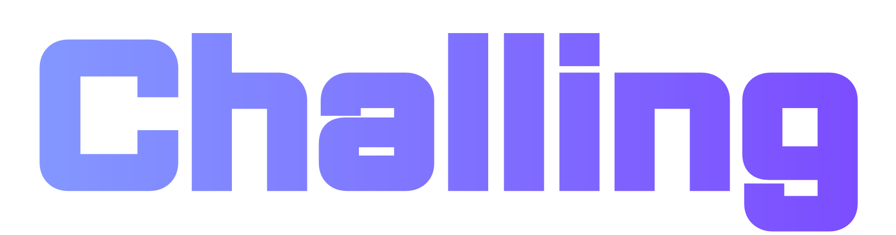
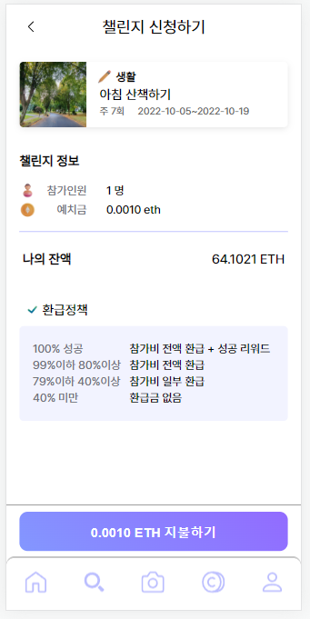
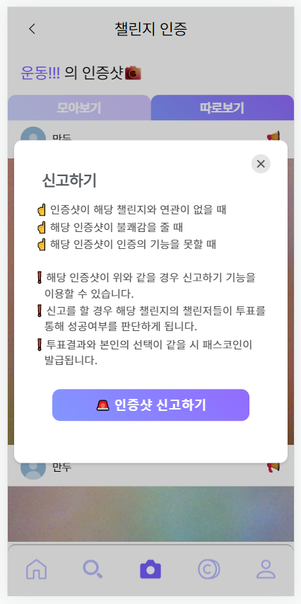

# Challing

챌링 _Challing_

> 도전을 뜻하는 Challenge (챌린지) 와 동전소리 Cling (클링) 을 합한 이름입니다.

## Table of content

Table of content

- [프로젝트 개요](#-%ED%94%84%EB%A1%9C%EC%A0%9D%ED%8A%B8-%EA%B0%9C%EC%9A%94)
- [개발 기간](#-%EA%B0%9C%EB%B0%9C-%EA%B8%B0%EA%B0%84)
- [서비스 소개 영상](#-%EC%84%9C%EB%B9%84%EC%8A%A4-%EC%86%8C%EA%B0%9C-%EC%98%81%EC%83%81)
- [팀](#-%ED%8C%80)
- [기술 스택](#-%EF%B8%8F-%EA%B8%B0%EC%88%A0-%EC%8A%A4%ED%83%9D)
	- [Infra](#-infra)
	- [Front-End](#-front-end)
	- [Back-End](#-back-end)
	- [Blockchain](#-blockchain)
- [아키텍처](#-%EF%B8%8F-%EC%95%84%ED%82%A4%ED%85%8D%EC%B2%98)
- [기획 배경](#-%EA%B8%B0%ED%9A%8D-%EB%B0%B0%EA%B2%BD)
- [주요 기능](#-%EC%A3%BC%EC%9A%94-%EA%B8%B0%EB%8A%A5)
	- [홈 화면](#-%ED%99%88-%ED%99%94%EB%A9%B4)
	- [로그인](#-%EB%A1%9C%EA%B7%B8%EC%9D%B8)
	- [챌린지 개설](#-%EC%B1%8C%EB%A6%B0%EC%A7%80-%EA%B0%9C%EC%84%A4)
	- [챌린지 참여](#-%EC%B1%8C%EB%A6%B0%EC%A7%80-%EC%B0%B8%EC%97%AC)
	- [챌린지 활동 인증](#-%EC%B1%8C%EB%A6%B0%EC%A7%80-%ED%99%9C%EB%8F%99-%EC%9D%B8%EC%A6%9D)
	- [패스코인 사용](#-%ED%8C%A8%EC%8A%A4%EC%BD%94%EC%9D%B8-%EC%82%AC%EC%9A%A9)
	- [허위 인증샷 신고](#-%ED%97%88%EC%9C%84-%EC%9D%B8%EC%A6%9D%EC%83%B7-%EC%8B%A0%EA%B3%A0)
	- [인증샷 투표](#-%EC%9D%B8%EC%A6%9D%EC%83%B7-%ED%88%AC%ED%91%9C)
	- [정산](#-%EC%A0%95%EC%82%B0)
	- [거래 내역](#-%EA%B1%B0%EB%9E%98-%EB%82%B4%EC%97%AD)
- [Why 블록체인](#-why-%EB%B8%94%EB%A1%9D%EC%B2%B4%EC%9D%B8)
	- [서비스 재화](#-%EC%84%9C%EB%B9%84%EC%8A%A4-%EC%9E%AC%ED%99%94)
	- [탈중앙화](#-%ED%83%88%EC%A4%91%EC%95%99%ED%99%94)
- [Wiki](#-wiki)
	- [Team Notion](#-team-notion)
	- [Porting manual](#-porting-manual)

## 📑 프로젝트 개요

**예치금을 내고 매일 챌린지를 인증하여 좋은 습관을 형성하거나 기부 캠페인에 참여하는 _블록체인_ 챌린지 플랫폼 Challing 입니다.**

_서비스를 두줄로 요약해보겠습니다._

1. 돈을 걸고 챌린지에 참여하여 리워드까지 받을 수 있는 일상챌린지
2. 좋아하는 인플루언서와 좋은 뜻을 함께하는 기부챌린지

## 📆 개발 기간

2022년 8월 29일 ~ 2022년 10월 7일 (6주)

## 🎞 서비스 소개 영상

[UCC](반출하고-각자-알아서-채울-곳입니다)

## 🌟 팀

| 🏍 조항주 | 📢 권다솜 | 👷🏻‍♂️ 송제영 | 🍮 이예은 | 🎙 정아현 | 🎀 차송희 |
|:---:|:---:|:---:|:---:|:---:|:---:|
|  |  |  |  |  |  |
| **팀장** | 팀원 | 팀원 | 팀원 | 팀원 | 팀원 |
| Smart Contract, BE, FE | FE, Smart Contract, UCC | BE, Deploying, Smart Contract | BE, FE, Smart Contract | FE, Smart Contract, Presentation | BE, FE, Smart Contract |

## 🛠️ 기술 스택

### 🛰 Infra

 

### 💎 Front-End

 

### 👩🏻‍🔧 Back-End

 

 

### 💠 Blockchain

## 👷🏻‍♂️ 아키텍처

Jenkins, GitLab Web hook 을 이용한 자동배포

## 🌱 기획 배경

> Ritual life : 리추얼 라이프란 자신의 삶에 긍정적인 변화를 주고자 형성하는, 일상에 활력을 불어넣는 규칙적인 습관을 말합니다.

**리추얼**은 최근 **MZ** 세대에게 중요한 삶의 패턴이 되었고 **갓생**이라는 밈으로 이를 **공유**하는 문화가 형성되고 있습니다. 또한 **인플루언서**의 영향력을 이용하여 **MZ**세대에게 좋은 의미를 가진 활동에 참여하는 것을 독려하고, **인플루언서** 본인 또한 홍보 효과를 누릴 수 있습니다.

> **\#리추얼**, **\#MZ**, **\#갓생**, **\#공유**, **\#인플루언서**

## 📌 주요 기능

### ✔ 홈 화면

- 홈 화면에서 현재 참여자 모집 중인 챌린지를 볼 수 있습니다.
- 설정한 관심사의 챌린지가 우선으로 보입니다.

### ✔ 로그인

- 소셜 인증을 통해 손쉽게 로그인이 가능합니다.
- 사용자 정보는 관심사 및 프로필 사진, 즐겨찾기에 사용됩니다.

### ✔ 챌린지 개설

- 좋은 습관을 만들기 위해 다양한 카테고리의 **일상 챌린지**를 개설할 수 있습니다.
- 인플루언서는 **기부 챌린지**를 개설해 좋은 일을 하며 자신의 팬들에게 선한 영향력을 행사할 수 있습니다.

- 챌린지 개설 최종 확인 화면

### ✔ 챌린지 참여

- 챌린지 상세 페이지에서 챌린지 참여가 가능합니다.

- 챌린지 개설시 설정된 예치금을 지불하는 것으로 챌린지에 참여합니다.

### ✔ 챌린지 활동 인증

- 인증샷 촬영으로 챌린지 활동을 인증합니다.

### ✔ 패스코인 사용

- 인증하는 대신 **패스코인**을 지불하는 것으로 인증을 대체할 수 있습니다.

### ✔ 허위 인증샷 신고

- 유효하지 않은 인증샷을 신고할 수 있습니다.

### ✔ 인증샷 투표

- 참여 중인 사용자들은 신고 당한 인증샷에 대해 그 유효성을 **투표**할 수 있습니다.
	- **다수의 선택**이 판정 결과가 되며 자신의 선택과 일치할 경우 **서비스 품질에 기여**한 것이므로 패스코인으로 그 **보상**을 받습니다.

### ✔ 정산

- 챌린지 기간이 종료되면 인증 달성률에 따라 정산을 받습니다.
	- 100% 달성하지 못할 경우, ( 예치금 × 달성률 ) 에 해당하는 금액을 환급 받습니다.
	- 100% 달성할 경우, 자신의 예치금을 모두 환급 받고 100% 달성하지 못한 사용자에게서 남은 예치금을 모두 나눠 갖습니다.

### ✔ 거래 내역

- 서비스를 이용한 내역을 확인할 수 있습니다.

## ❓ Why 블록체인

**예치금**, **기부금**을 입금하고 챌린지 결과에 따라 리워드가 지급되는 서비스 입니다.

거래가 이상없이 진행되고 있는지, 내가 리워드를 잘 받았는지, 기부금이 잘 전달되었는지 **투명하게** 공개되어야 합니다. 즉 **신뢰**가 필요합니다.

블록체인의 **투명성**과 **무결성** 그리고 **스마트 컨트랙트**를 활용하여 이를 해결할 수 있습니다.

### 💰 서비스 재화

**메타마스크**를 이용하여 사용자는 본인의 **이더리움**을 예치 또는 기부의 지불 수단으로 사용합니다.

서비스에서 사용하는 **패스코인**은 **ERC-20**를 준수하여 구현했습니다.

### 🗝 탈중앙화

인증 사진이 실제로 해당 챌린지의 **유효한** 인증 사진인지 **판정**이 필요합니다. 그렇지 않으면 반쪽짜리 서비스이기 때문입니다.

인증 사진의 유효성은 **스마트 컨트랙트**를 이용하여 챌린지에 **참여 중인 사람들**의 신고와 투표로 **투명하게** 판정됩니다.

이를 통해 사용자는 **Middleman** (중개인) 의 개입 없이 서비스를 **신뢰**할 수 있습니다.

> 다수는 옳다.

투표에 **참여**하여 **다수의 결정**에 같은 선택을 한 사용자에게 **패스코인**이 지급되고 보유한 패스코인을 지불하는 것으로 챌린지 인증을 대체할 수 있습니다. 이를 통해 사용자가 네트워크에 참여할 **동기부여**가 되고 서비스가 더 견고해집니다.

## 🔗 Wiki

### 🤝🏻 Team Notion

- [Team Notion](https://soapy-haddock-e90.notion.site/B106-d25376cf8fa24664b89b26a943aa94bd)
	- 기획, 설계, 와이어프레임, 스크럼, 기능 명세, API 명세, ERD

### 🛳 Porting manual

- [Porting manual](./exec/)
	- 빌드 가이드, 외부 서비스, DB 덤프, 시연 시나리오
